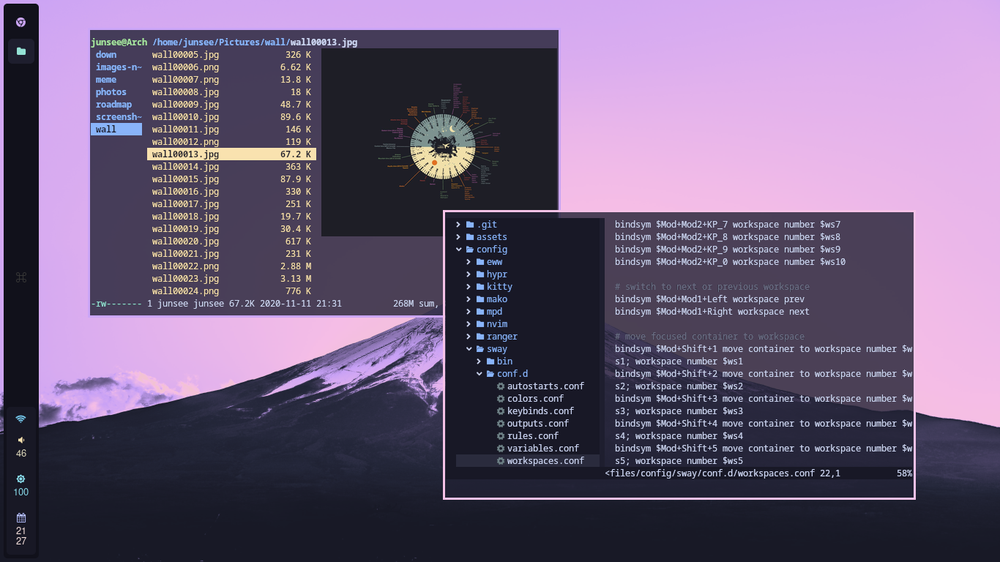
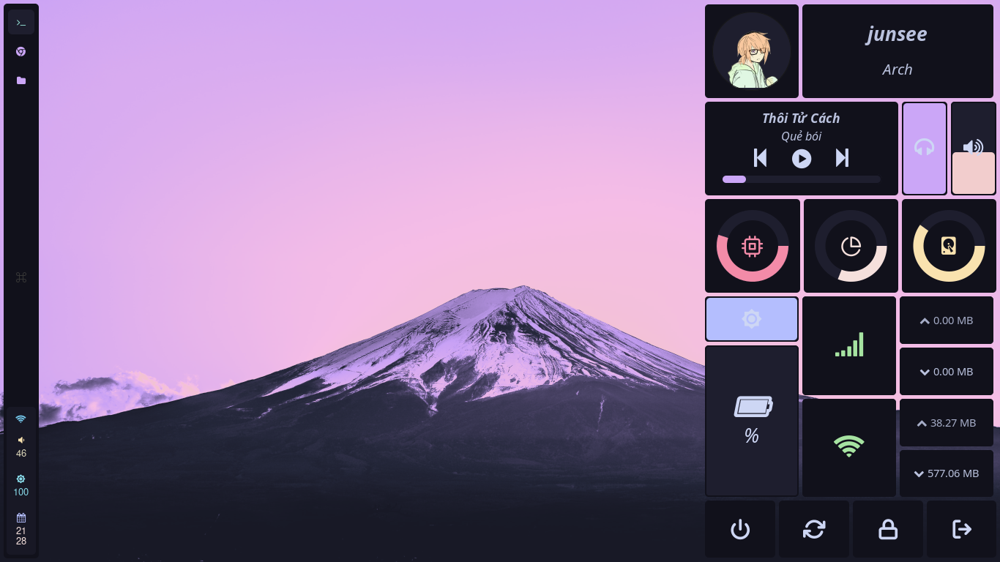

# dotfile

  

  <b>Junsee1412's configuration files 🫠</b>

## **Showcase**

## **Environment**

- OS: **[Arch Linux](https://archlinux.org/)**
- WM: **[Sway](https://swaywm.org/)**
- Terminal: **[Alacritty](https://github.com/alacritty/alacritty)**
- Screenshot tool: **[Grim](https://github.com/emersion/grim)**
- GUI file manager: **[Thunar](https://github.com/xfce-mirror/thunar)**
- Screen locker: **[Swaylock](https://github.com/swaywm/swaylock)**
- GTK theme selector: **[Nwg Look](https://github.com/nwg-piotr/nwg-look)**
- GUI Volume managment: **[Pavucontrol](https://github.com/pulseaudio/pavucontrol)**